# Mise en place d'un environnement Linux

Si vous êtes déjà sur Linux ou MacOS, vous n'êtes pas concernés par ce tutoriel. Si vous êtes sur Windows, préférez la solution WSL.

# Installation de la distribution Ubuntu sur votre Windows (Windows Subsystem for Linux - WSL)

Lien utile pour l'installation : https://www.ionos.fr/digitalguide/serveur/know-how/windows-subsystem-for-linux-wsl/

Le pré-requis pour suivre cette installation est de disposer de la version 64  bit de Windows 1709 ou suivantes (https://fr.wikipedia.org/wiki/Historique_des_versions_de_Windows_10). Pour vérifier:
* Appuyez sur les touches du clavier *Windows + R*, tapez « winver » dans le champ de texte qui se présente et appuyez sur *Entrée*, ou bien
* Cliquez sur Démarrer > Paramètres > Système > Informations système : sur cette page, vous trouverez l’information souhaitée dans la rubrique « Spécifications Windows ».

Si vous ne remplissez pas les pré-requis, vous pouvez suivre la procédure d'installation d'une VirtualBox. Sinon:

* Dans la zone de recherche de la barre des tâches, tapez « panneau de configuration ». Ouvrez le panneau de configuration puis cliquez sur Programmes > Programmes et fonctionnalités > Activer ou désactiver des fonctionnalités Windows.
* Cochez la case pour « Sous-système Windows pour Linux ».
* Redémarrez votre ordinateur.
* Ouvrez Microsoft Store et lancez une recherche pour « Ubuntu ».
* Installez l'application nommée simplement "Ubuntu".
* Une fois l’installation terminée, cliquez sur « Lancer ».
* Dans la fenêtre qui s’ouvre, au premier démarrage, le logiciel télécharge et décompresse des paquets. Cette étape peut prendre quelques minutes. Enfin, le logiciel vous invitera à définir un nom d’utilisateur et le mot de passe associé pour votre nouvelle installation Linux.

Le système Ubuntu est installé sur le système hôte à cet emplacement: *C:\Users\<username>\AppData\Local\Packages\CanonicalGroupLimited.UbuntuonWindows_79rhkp1fndgsc\LocalState*.

Vous pouvez accéder au système hôte à partir du chemin suivant: */mnt/c*.

# Procédure d'installation d'une VirtualBox

Ce guide permet d'installer une machine virtuelle de type Linux (*Light Ubuntu*) à partir du logiciel VirtualBox.

# Procédures

* Télécharger et installer VirtualBox. Rendez-vous sur au lien suivant https://www.virtualbox.org/wiki/Downloads et sélectionner votre système d'exploitation hôte.

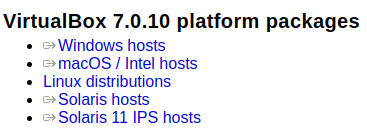

* Télécharger l'image disque (*iso*) de *Light Ubuntu* au lien suivant https://lubuntu.net/lubuntu-18-04-bionic-beaver-released/ (~1,1Go) et sélectionner l'architecture processeur **appropriée** (32 ou 64 *bits*).

* Ouvrir VirtualBox.

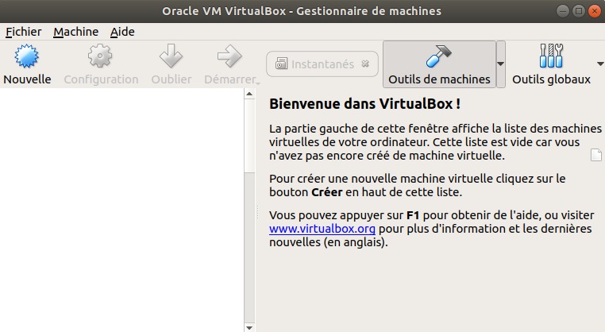

* Créer une nouvelle machine virtuelle à partir du bouton "Nouvelle".

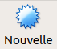

* Nommer votre machine virtuelle, attribuer le type Linux et la version Ubuntu (32 ou 64 *bits* selon votre *iso*).

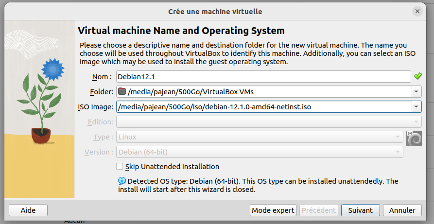

* Attribuer entre 2 et 4 Go de mémoire vive à votre machine virtuelle (selon la capacité de votre machine hôte).

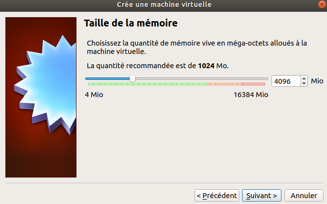

* Créer un disque dur virtuel.

* Sélectionner l'option **VDI**.

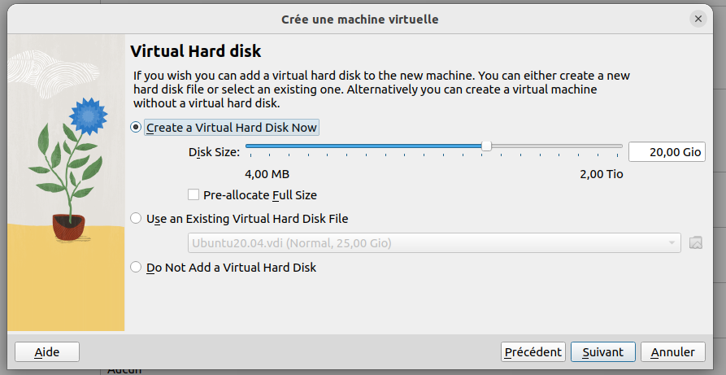

* Sélectionner l'option **Dynamiquement alloué** (pour avoir un espace de stockage dynamique).

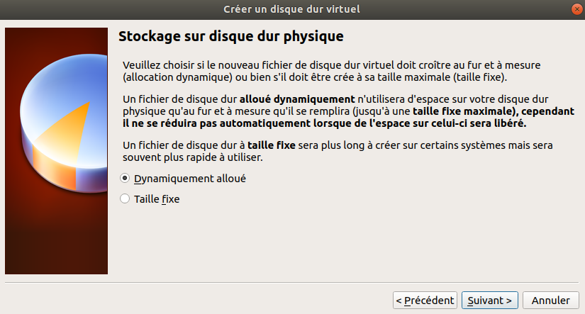

* Allouer 10 Go à votre disque dur.

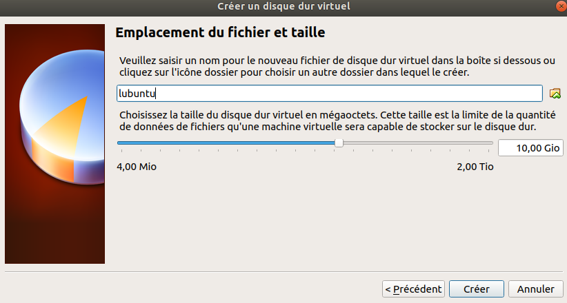

* Démarrer la machine virtuelle.

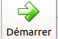

* Sélectionner l'*iso* de *Light Ubuntu*.

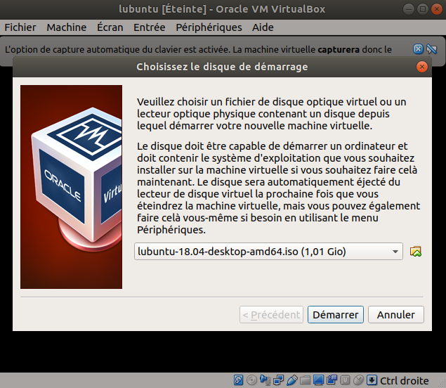

* Sélectionner la langue.

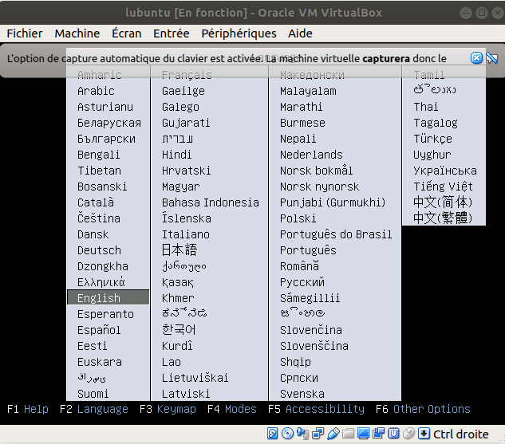

* Installer Lubuntu.

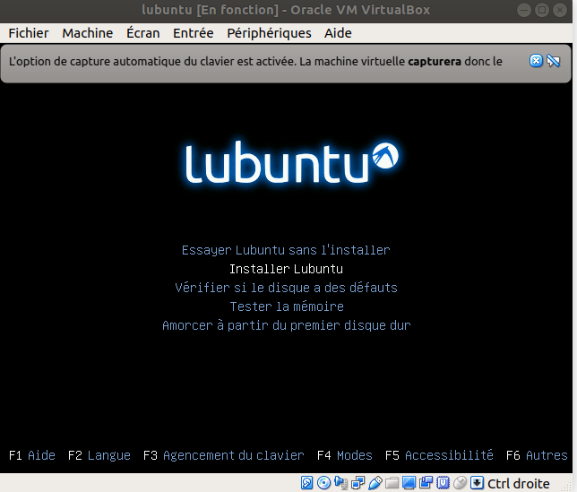

* Configuration de Lubuntu.

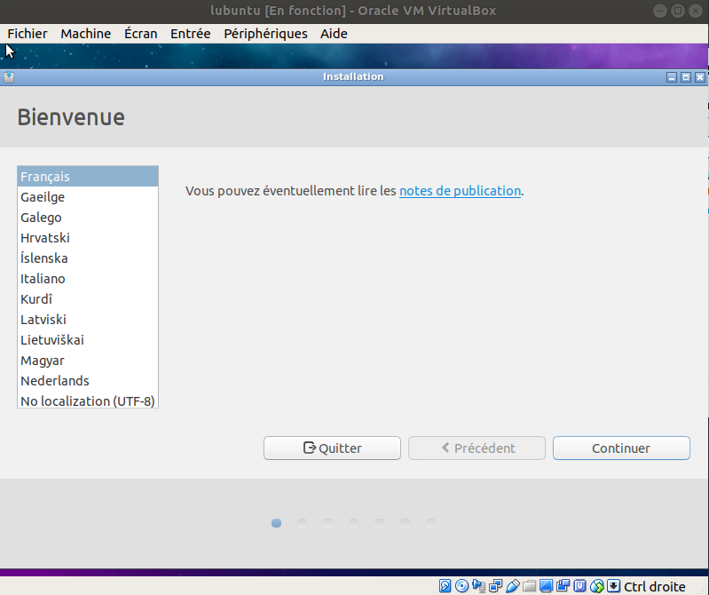
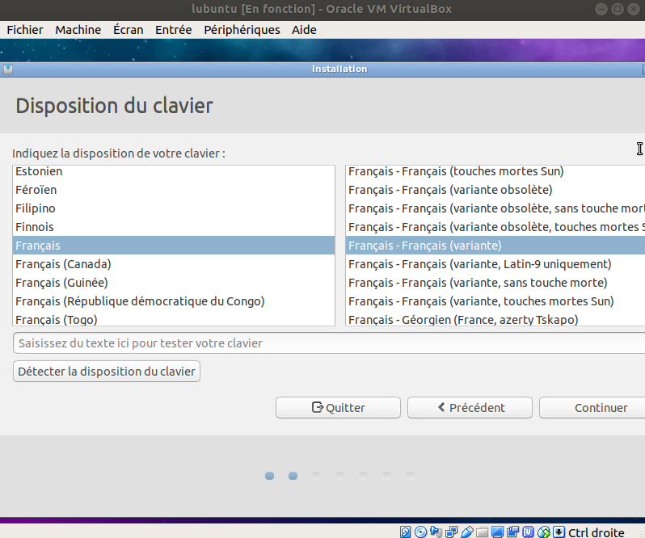
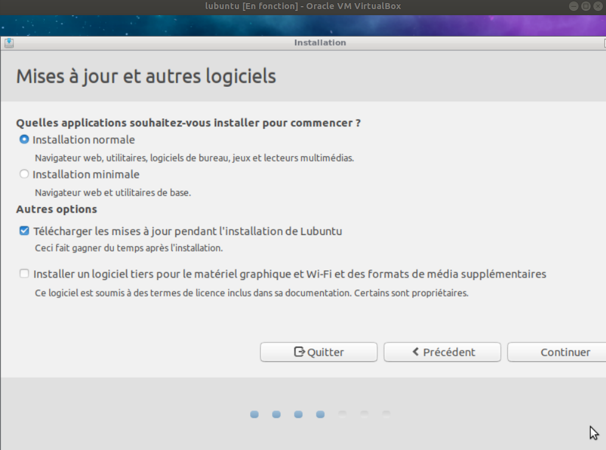
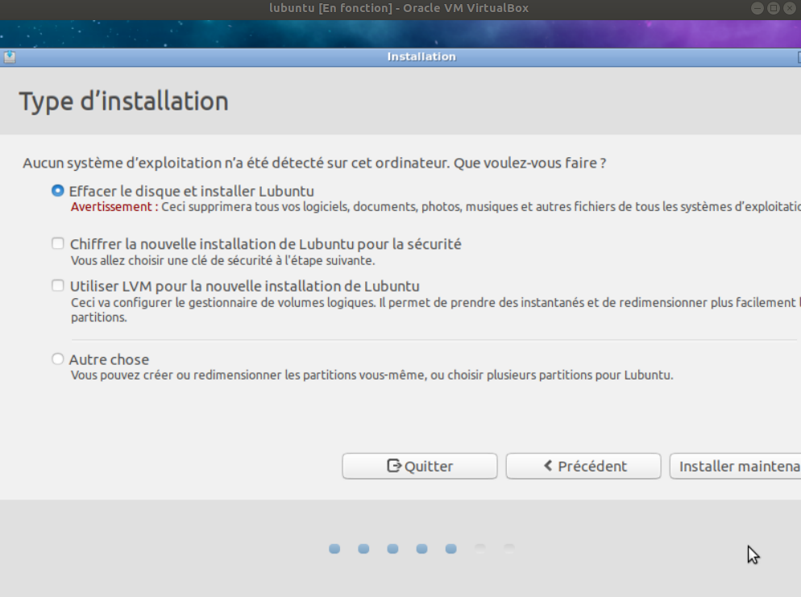

* Redémarrer Lubuntu.
* Accéder à votre Lubuntu.

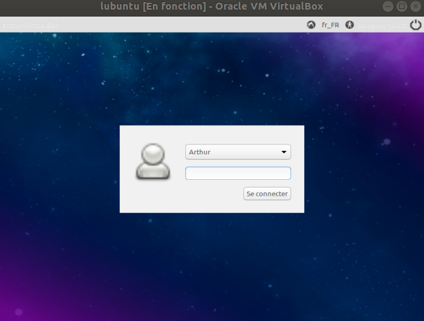

# Auteur

Pierre-Antoine Jean (IMT Mines Alès).