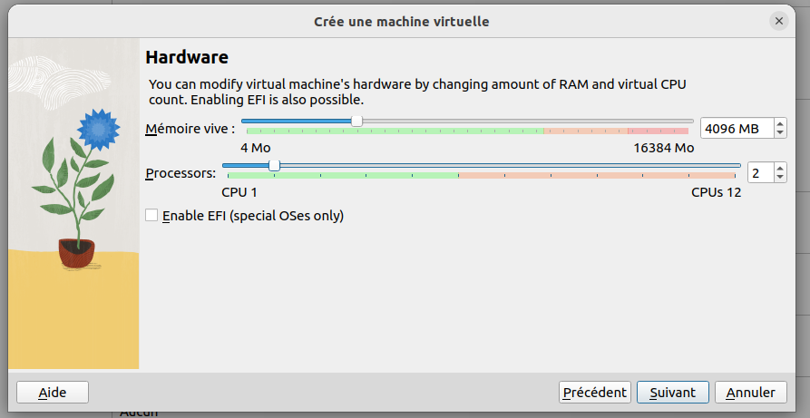

# Mise en place d'un environnement Linux

Si vous êtes déjà sur Linux (voir MacOS), vous n'êtes pas concernés par ce tutoriel. Dans le cas contraire, voici différentes manières d'accéder à un environnement Linux.

# Solutions *onlines*

## Replit

La plateforme de collaboration Replit est un IDE en ligne offrant la possibilité d'héberger des applications web. Elle propose d'accéder à un terminal (distribution Linux NixOs) et d'importer des répertoires depuis Github.

* Rendez-vous sur https://replit.com/.
* Créer un compte.
* Créer un nouveau *Repl*.
* *Import from Github*.
* Copier/Coller le lien de ce répertoire Github (https://github.com/PAJEAN/cours_linux).
* Appuyer sur *Import from GitHub* en conservant le champ *Blank Repl*.
* Accéder au *Shell*.

## MyBinder (non recommandé)

La solution MyBinder ne requiert pas de compte. Toutefois, votre progression d'une session à l'autre sera perdue. Pour démarrer un nouveau container, il vous suffit simplement de cliquer sur le bouton ci-dessous afin d'accéder à un environnement JupyterLab incluant les fichiers de ce répertoire Github. Cliquer sur "Terminal" lorsque vous êtes à l'écran d'accueil du JupyterLab.

# Installation d'une VirtualBox

Ce guide permet d'installer une machine virtuelle *Debian* à partir du logiciel VirtualBox. Votre machine doit être dotée d'au moins 8Go de RAM (afin d'éviter d'éventuels ralentissements).

* Télécharger et installer VirtualBox. Rendez-vous au lien suivant https://www.virtualbox.org/wiki/Downloads et sélectionner votre système d'exploitation hôte.

* Télécharger l'image disque (*iso*) de *Debian* au lien suivant https://www.debian.org/CD/http-ftp/#stable (~650Mo) et sélectionner l'architecture processeur **appropriée** (32 ou 64 *bits*).

* Ouvrir VirtualBox.

* Créer une nouvelle machine virtuelle à partir du bouton "Nouvelle".

* Nommer votre machine virtuelle et indiquer la localisation de l'image iso.

* Renseigner un nom d'utilisateur et un mot de passe. **Cocher la case** ***Guest Additions***.

* Attribuer 4 Go de mémoire vive à votre machine virtuelle (à définir en fonction de la capacité de votre machine hôte).

* Créer un disque dur virtuel. Allouer 20 Go à votre disque dur (à définir en fonction de vos besoins).

* Valider et patienter durant l'installation.

* Démarrer la machine virtuelle et identifiez-vous (**attention le clavier est configuré en qwerty par défaut**).

* Configurer la langue et le clavier (Activités/Paramètres/Pays et langue, Activités/Paramètres/Clavier).

# Installation de la distribution Ubuntu sur votre Windows 10 (Windows Subsystem for Linux - WSL)

Lien utile pour l'installation (testée uniquement sur Windows 10): https://www.ionos.fr/digitalguide/serveur/know-how/windows-subsystem-for-linux-wsl/

Le prérequis pour suivre cette installation est de disposer de la version 64 bit de Windows 1709 ou supérieure (https://fr.wikipedia.org/wiki/Historique_des_versions_de_Windows_10). Pour vérifier:
* Appuyer sur les touches du clavier *Windows + R*, taper « winver » dans le champ de texte qui se présente et appuyez sur *Entrée*, ou bien
* Cliquer sur Démarrer > Paramètres > Système > Informations système : sur cette page, rechercher l’information souhaitée dans la rubrique « Spécifications Windows ».

Si vous remplissez les prérequis:

* Dans la zone de recherche de la barre des tâches, taper « panneau de configuration ». Ouvrir le panneau de configuration puis cliquer sur Programmes > Programmes et fonctionnalités > Activer ou désactiver des fonctionnalités Windows.
* Cocher la case pour « Sous-système Windows pour Linux ».
* Redémarrer votre ordinateur.
* Ouvrir Microsoft Store et lancer une recherche pour « Ubuntu ».
* Installer l'application nommée simplement « Ubuntu ».
* Une fois l’installation terminée, cliquer sur "Lancer".
* Dans la fenêtre qui s’ouvre, au premier démarrage, le logiciel télécharge et décompresse des paquets. Cette étape peut prendre quelques minutes. Ensuite, le logiciel vous invitera à définir un nom d’utilisateur et le mot de passe associé pour votre nouvelle installation Linux.

Le système Ubuntu est installé sur le système hôte à cet emplacement: *C:\Users\<username>\AppData\Local\Packages\CanonicalGroupLimited.UbuntuonWindows_79rhkp1fndgsc\LocalState*.

Le système hôte dans l'arborescence d'Ubuntu se situe via le chemin suivant: */mnt/c*.

NB: selon la configuration de votre machine, vous devez activer les options de virtualisation au sein de votre BIOS.

# Auteur

Pierre-Antoine Jean (IMT Mines Alès).