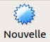
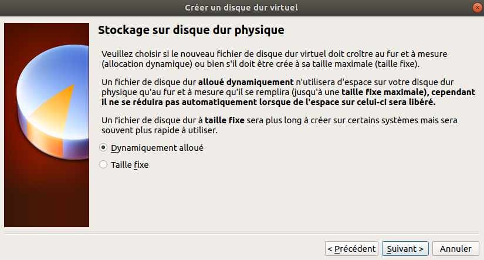
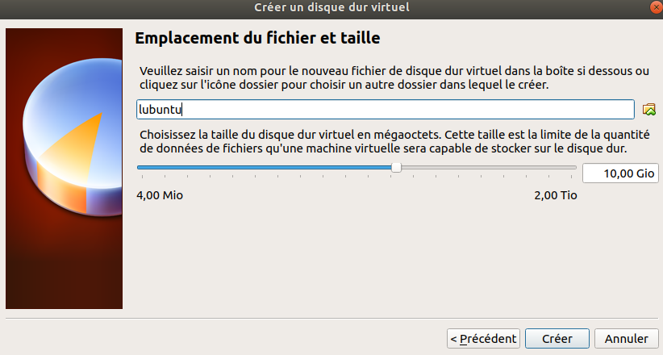
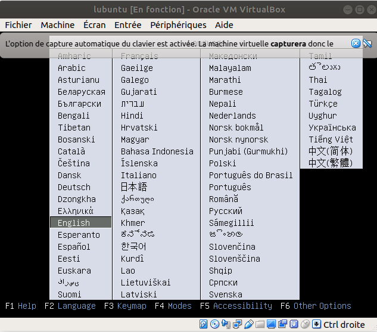
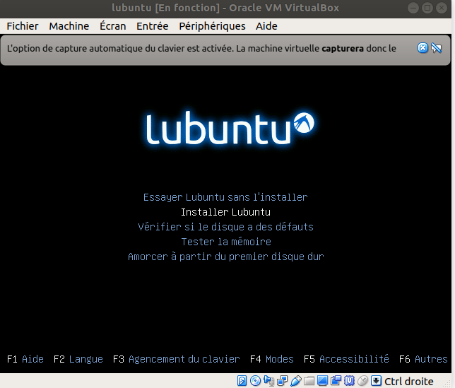
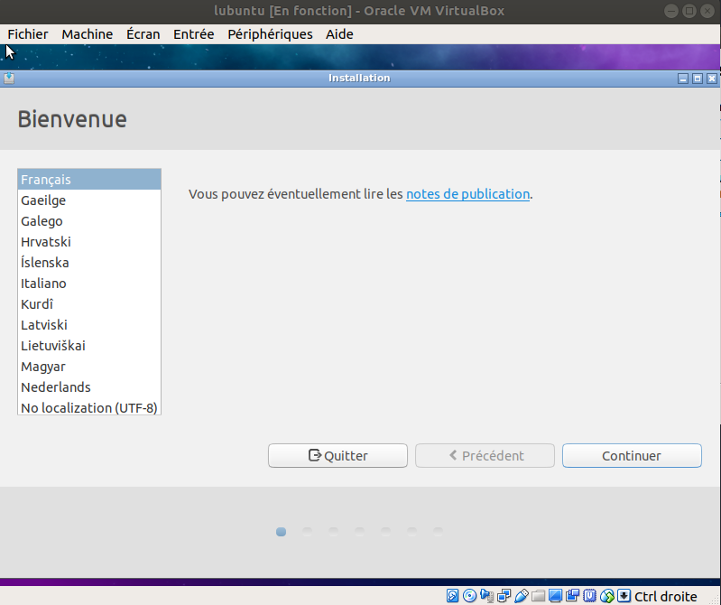

# Procédure d'installation d'une VirtualBox

Ce guide permet d'installer une machine virtuelle de type Linux (*Light Ubuntu*) à partir du logiciel VirtualBox.

# Procédures

* Télécharger et installer VirtualBox. Rendez-vous sur au lien suivant https://www.virtualbox.org/wiki/Downloads et sélectionner votre système d'exploitation hôte.

* Télécharger l'image disque (*iso*) de *Light Ubuntu* au lien suivant https://lubuntu.net/lubuntu-18-04-bionic-beaver-released/ (~1,1Go) et sélectionner l'architecture processeur **appropriée** (32 ou 64 *bits*).

* Ouvrir VirtualBox.

* Créer une nouvelle machine virtuelle à partir du bouton "Nouvelle".

* Nommer votre machine virtuelle, attribuer le type Linux et la version Ubuntu (32 ou 64 *bits* selon votre *iso*).

* Attribuer entre 2 et 4 Go de mémoire vive à votre machine virtuelle (selon la capacité de votre machine hôte).

* Créer un disque dur virtuel.

* Sélectionner l'option **VDI**.

* Sélectionner l'option **Dynamiquement alloué** (pour avoir un espace de stockage dynamique).

* Allouer 10 Go à votre disque dur.

* Démarrer la machine virtuelle.

* Sélectionner l'*iso* de *Light Ubuntu*.

* Sélectionner la langue.

* Installer Lubuntu.

* Configuration de Lubuntu.

* Redémarrer Lubuntu.
* Accéder à votre Lubuntu.

# Auteur

Pierre-Antoine Jean (IMT Mines Alès).